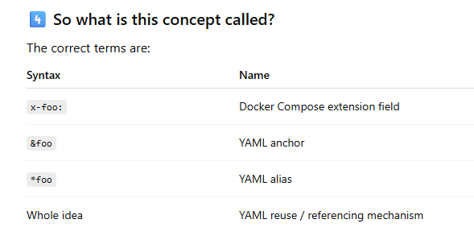
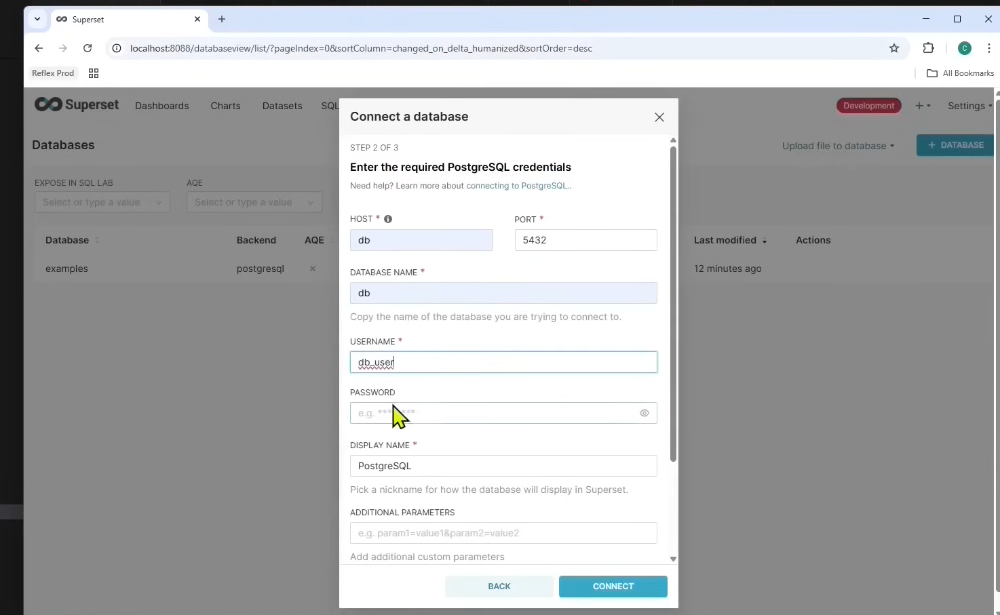
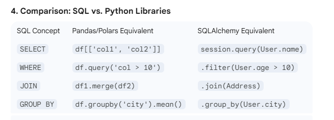
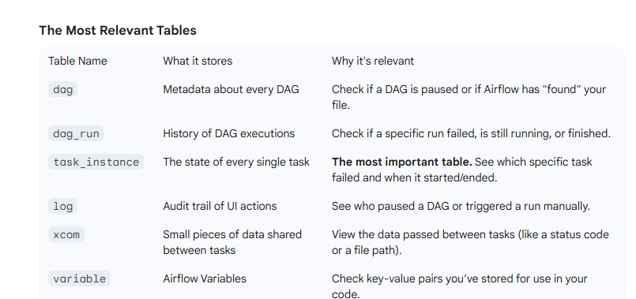
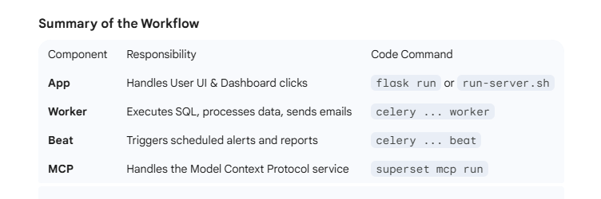

# About Project
A project that will ingest data from weather API each 5 minutes, it will store in the postgresql database
dbt will enable some trasnformations  to process data and create new tables. 
an airflow service will provide  automatic schedules. 
Sueperset will visualsize  the tables. 

services will be containerized.

# Project basics, Environment settings: wsl connected vs code & docker desktor with wsl enabled
* some question to understand the setup:
? Docker Desktop enable wsl , how and where we can do it?
? what does wsl integration means? A: bridge between 
? to make python python3 we need to make alias. 
? Docker Desktop wsl enabled or install Docker inside wsl? 
ChatGpt says they are almost identical but 

? wsl enabled, wscode connected wsl konularında chatGPT 3 tane chat.
https://chatgpt.com/share/697f2e15-036c-8010-9e2b-859c6fb56085

- Leftdonw corner of vsCode thw <> button.  Then connect remote wsl suing distro. wile  yo u are using wsl. it it is the there. 
The above chatgpt  may . IT seems the wsl is creating its containers  direcly. 

  ? Role of DAG in airflow. 
  A: airflow  will accept the orchestarator.py in python always. 

  * import neighboring file.py  for a specific function: how it know the path to the file.  
  A:either like "from FolderA.FolderB.file import func2" or like sys.path.append('/FolderX/folderY') from file2 import func2.

# Docker and  containerisation related topics

* command property in d-c.yml file is different from CMD or ENTYPOINT in Dockerfile
? for dbt, it it advisible to include a command property in d-c.yml? A: not in general. but for CI pipelines, recommended. 

* up/down a single container. // specific command in cli
?

* mount: think not geometric restriction,  rather as loose category naming:
mount is very flexible. the parent folder can mount to a different place while the child  folder can mount to a different place.

* Mount obj of Airflow Docker Operator or Docker Python SDK
? mount args or option: source, target, type . Are there other parameters? A: depends o nthe 

* networks in 

* docker-compose  resuable config blogs: x- , *,&  

x- extensien field.
&name TAML anchor.  sağ tarafta yer alır.
*name aşağda container içinde çağrılır. 

* 
#### down/up/restart for containers. 
? when I remove a mounted folder, and unmount the container.  there is problem. I need to don -v the container after rm -rf data, and then up to work? See also volumes section.

#### ownership /group id
? 
srw-rw---- 1 root docker 0 Feb  5 15:24 /var/run/docker.sock
Do you think this is the problem? 

stat -c '%g' /var/run/docker.sock
1000
who is groupId 1000? A: the first group? for me it was docker

* to test container creeted folder and host(me) created mounts
? mycreatedFolder:place1 ->wont change osman:osman
MyNONCREATED:place2 --> root:root olacak. sanırım app tarafından oluşturulanlar appınkini alabilir. 

* down/restart.
? after I modifed docker-compose.yaml file for af, should I "af down -v " and then "up af" or simly "restart af"
A: up is smart enought to mend its own business
- it seems these groups and names depends on whether you have them on your wsl host. if not, they will be apeared as numbers and wont be shown even. "getent group 999" -> no result, becaue I dont have psql on wsl.

* to modifey file change owner of group
to write sometihn inside a file, is it important to modify the owner or group? either make the owner yourself or make the group yourself or putyourself in the group?
A: I guess all 3 are possible

* set -e & -o pipefail
set -e to ensure EXIT, -o pipefail is to ensure in docker

# CONTAINERS

  ## Postgresql service and container. 
  I will not give that much detail about this service here. one of the contrasting thing that I have learnt  is that it is the this service that  do the computing. The fact that the dbt container specifies 4 threads is to send 4 concurrent jobs/batch to the psql service. The psql service itself handle its own threading or parallelism.

* pralelllism 
? dbt service/container mentions 4 threads. how postgresql will respond to work in 4 threads? is it the responsibility of the postgresql to manage  or coordinate the ouput of different processes at the same time? what are the configuratiıns in postgresql that handle this issue? I guess defining 4 threads in dbt measn setting one of these settings  to 4? 

A: yes psql has an internal setting and way of handling parallelism. seemingly, the dbt 4 threads are basically for dbt, roughly means 4 connections to psql.

* two external folders: one for initial db for airflow
other  possible other folder to to display data

* creating databases and users and granting priv
? here, for airflow a user_airflow and db_airflow are creation with OWNER keyword.  there is also a way to first create database, then ccreate user, then Grant privileses on database to the user. I guess they are functionally the same. 
A: same with nuances. https://gemini.google.com/share/e4672592a8fc

* why we need extra db_airflow and ALCHEMY?

* different databases and data
I guess data belong to the whole application. for this, a special database would be created in the psql.other services or containers would have their own  databases  for metadata, their logs.. in the postgresql server.  One of the key element is to know that  other containers would  connect to the app_data externally, I mean either through a python code connection (for ingestion of data), or via credentials in a config file (dbt profiles.yml file), or web GUI ( superset web UI has a menu to make a connection to the app_data database.)

### containers: topics revised.

* profile file inside /root/.dbt on the image.
?    volumes:
      - ./dbt/my_prj:/usr/app
      - ./dbt:/root/.dbt
for the dbt container, what is the role "/root/.dbt"? what are inside it? 
A: the proifle.yml which is about user and environment lyes here. /root/.dbt is like home/.ssh where this folder contains some files.

* multiple and mixed mountings inside a folder
? as in the question above, subfolder is mounted to a place, the whole folder is mounted to a different place. How this can be possible?
but during the createion of the container, if the host side is not present, the container create the folders. if there are nested mounts, isn there a risk of overriting and loss of data?

A: a long answer. it seems docker /mounting is adiferent thing than what I imagine.

* working_dir directive
This is generally related only for ht CMD 

* file or folder permissions.
I have observerd that the folders you create on project side stay as they are. the ones that are created even the subfolders get the permissions and ownership of by the docker, which is root. 

?drwx------ 19   999 root  4096 Feb  5 16:29 data
who is the owner? how can I see the data folder in the wscode even I dont have permissions ? is it because I have read permission on the parent folder, hence I see the folder data without entering inside it?
A: 999 ghowst owner, postgresql user UID. Yes as you have r on parent folder, you see it.

? osman@Sevim:~/reposProjects/weather-data-prj/postgres$ sudo ls -ls data/
 4 -rw------- 1 999 999     3 Feb  5 16:29 PG_VERSION
 4 drwx------ 7 999 999  4096 Feb  5 16:29 base
 interesitngly the sub folder owner and group are both 999 while the data folder was 999:root? A: data folder is created by the Docker which makes root. then it is postgres process that has created files on the container and they are visible due to mount. 

* for DAG's Operators
docker newWAterPipes. python: a patern in the waterPipe.
a pythonOperator only invoke a function, a DockerOperator  needs to connect to the the process

? auto_remove in DockerOperator as Dag Operator means what? Do you imply that for each trigger  a new container is created? 
for the pytohnOperator there is no such thing as removing something, python_code is smal pattern we put in the water pipe
 while Docker means  similer pipe incorporate that include pattern already.  if Docker is extra pipeline, better to detach or finish it.
 containr is not a big solid thing, it is a new process, new  bash fork

* volumes: named volume vs host path vs tmpfs (emphemeral)
if you create a volumes section, this is a docker managed volume. 
if you create like host/path:docker/path this is called binding mount or host path. 

? why cashe applicaticain like Redis uses managed volumes
A:because faster and less permission problems.

* delete old volumes for container creation: situation for named and host volumes.
see:https://chatgpt.com/share/6987775f-72d0-8010-9a87-f66e99516227
Shortly:volumes stays, also if there is data it dont creates, hence if there is a change reagarding database need to delete volume.

* access to container
 to access a contianer exteranlly, host is the localhost or akins. port is the host port like 5000 here in this project for postgress.
but if containers are communicaitong among themselves via a network, then host is name given in d-c.yml file. the port is the container port like 5432 for postgresql.

## POSTGRESQL container

### conneciton & create scehma && create table && Insert INTO for postgresql
 
fetch data function:
via request.get(url) takes url with key and city. which is a Response Class obj. we can turn into json. 

- variabels in fucntion scoe remains there UNLES they are RETURNED. here the connection establishe in a function is returned and used  in other functions.

the main function calls 
- the dataFetch function that return jsonDAtacreate 
-connection function that return conn obj.
-createTable (conn) that schema and table and cols
-insertData(conn,data) that put data into VALUES

 * pay attantion the functions  that include conn, starts with conn.cursor() and conn.cursor().execute("SQL language")

* standalone codes vs  codes in the project folder with mount. 
we can test if the python code is correctly fetching url data and inserting into psql successfully seperately via HOST PORT like 5000.
Then, we can put this code in the local project folder that is mounted on the container-airflow. Together with DAG_orchestrator file this will be imported via sys.path.append('path in the container that is mounted to PythonFolders in the project') together with statmenet like " from file.py inmport main". 

* python psycopg2  pacakages in the airflow image as well?
?I guess airflow image contains packages like pschopg2, in principle NO(DeepSeek)/ Actually YES according to the ChatGPT.
Do you think 3.0.0 include the package? or is ithe ALCHEMY that do the magic? Answer: airflow 3.0.0 does include psycopg2

AIRFLOW_DATABASE_SQL_ALCHEMY_CONN: postgresql+psycopg2://airflow:airflow£db:5432/airflow_db "  is not related to package dependency. it is about driver.

? the first task of DAG is to make a conection to the db_db to put data to here.

* each container will need a database to store its metadata in tables. Like users, daga logs....

* access to the container as database
 d-c exec db psql -U db_user -d db_db --> will open psql shell as root user in the db_db domain.
 "\c database user" will connect change the database and user without asking password, 

it seems

## Airflow container.

* manual non-container installation
? for a psql service and dbt tool, if we install an airflow  manually (non-container) what would be the  steps. what would be configs to pass during the installaiotn or after installiaton?

? but the container version is much compact like the following. we need image, a port, SQL_ALCHEMY and volume monts for dags adn python code. a command that migrate and start the server? 
A: the fact that container way, we prowide certain configuration via declerative  files lie like d-c and  mounted files makes things even easier.

so unlike dbt container, this airflow has a port, whcih make its more like a listening server- SERVICE.

* airflow containr connecting to psql
? the normal or non-container code was  making the connection via host port as 5000, however the airflow container will use the container port which is 5432, which are in the same network as  psql container. This modification is made in the python code that handle connection.

* an init.sql script in the psql container to create the airflodb and airflow ownser for this  
? password is passed inside quote becaue it is the LITERAL why the other is the name of the obj.

* command to run airflow.
 command: >
      bash -c "airflow db migrate && airflow standalone"
Does > has special meaning? like new process? -NO. it measn  you can put many lines of command.
 bash was creating a new child right?  YES. A NEw bash that interpret && for two consecutive commands
-c the whole string as command? YES. 

So, if the database were ready
command: airflow standalone -> this even can function, as it will be a running server. 

* dag and python code on the airflow container.
? on the container side /opt/airflow/dags is mounted on theproject folder. the python code folder is similarly mounted. the orches.py file append path and import related functions. 

* content of the dag files.
function or import of the function. default_args for the Operator type, I guess start_date is must arg. 
Creation of DAG object that define its Schedule or similar thing.
the definitions of tasks with DAG context.

### add a socket in airflow container to enable DockerOperator talk to dbt
 * socket to direclty host system BUT YOUTUBER DID IT WRONG?
       - {NO . ??}/var/run/docker.sock:/var/run/docker.sock

## dbt Container. 

* image properties
- under /usr/app it is the project folder. where models, logs, stagings are found.
- under /root/.dbt there is the profile file that includes psql connections infos, like profile of .ssh file.
- define working_dir because profile is important. 

-images go with the underlying database service like postgresql or mariadb... like dbt-postgres

-the project folder that is on the host is mounted to the a point where it is also the working directory. this way the dbt will see its profile file in the project folder. if there are multiple projects then either we setup multiple containers or modify running accordingly.

#### profile vs project file:
* profile config and working_dir (actually working_dir is for projectfile)
? which type of tools or services need a profile file, isterehr a realaitonship between profile and working_dir?
for dbt container we define working_Dir  directive because there is a profile file.   the profile file actually here include information about the psql container and database and  for connection.  
A: yes

?
* project folder when there is important structure like django

? Tehre is also the question of project folder isue. whcih type of tools or servcies have a project folder? does ssh service have the project folder?

? dbt needs a project structure because it should know the place of certaind folders like models, sources....

 ### profile file for  
* target, outputs, schema 
? as "outputs" in the profile file is plural, I guess we can have multiple outputs for a single target right? The schema is just an element in the database.

A: yes various outputs for various connection, but for the current running it is the target. so for each time a single target. This target can be passed as the option in the CLI.

### ROLE OF DBT
####  who does computing: psql or dbt? 
role of dbt is to generate sql statements and make  multiple connections to psql (threads for dbt). postgresql has its own paralelism or threads.

### One of the great benefits of dbt: jinja
with the help of dbt jinja, we have an extra interpretetion for sql queries or statements

* materialized:

* source -stage-display
? under models  folder: sources is like table columns, stagging is like a interim table. mart is like a final table for display

* materialisation means :

* types of materialisations:
1. table: 
2. view: virtual table 
3. incremental :only new changes from the last run
4. ephemeral : CTE (com Table exp)ö no data obj
5. materialized view : 

* incremental strategies: if type is incremental, then we need to define how should it be. it is technology/tool related

a. MERGE or INSERT/UPDATE . supported by who? psql yes.
b-delete+insert: all suprts this
c-insert_overwrite (only Spak and BigQuery)
d-append

### DockerOperator 
* 2 Mount object for - project and profile.

* DockerOperator and PythonOperator
? So the DockerOperator need to follow a bit dbt container specifictaions like mounts, sockets, working_diri ? Python operator means python engine, DockerOperator means accept the ouput of dbt? I guess NO. Airflow measn scheduler, triggering. either I apply my python code (pythonOperator) or I make a socket conneciton to the Docker for dbt to BUT there is sql code in the dbt. so python code lyes in airflow container, but sql coe lyes in dbt container

 ### SQL: other alternatives?
 ?SQL is like structing data. are ther pure python libraries that do the same thing with python code?
 

 * psql,airflow, dbt together do what? why 2 databases?
 A:becaue airflow itself has many tables like dag results.
 ?all the data will be preserved in the tables in postgres db,  airflow  will trigger the igestion of data from sources into db_db and will trigger another task that its primary function to run dbt for the new data in a tablee via models.

* ? role of ALCHEMY line
      AIRFLOW_DATABASE_SQL_ALCHEMY_CONN: postgresql+psycopg2://airflow:airflow@db:5432/airflow_db  
So this line in docker-compose.yml willconncec af to the airflow_db in psql as user airflow_user.  why he needs psycopg2. Aha I got it. psyopg2 is the thing of python and postgresql.

### dbt CLI applicaiton or container
these types are called cli Application not service . see d,fferences between services and applicaiton. for example tthere is no listening port here. 

while psql is a service that wait for reactions, dbt is a tool to be used sometimes. for this reason we will have schedulers in airflow.

* what if manual installation
pip install dbt-postgres && cd ~ && dbt init my_dbt_project ( this will create  profiles.yml that define psql connection)

dbt debug (to test connection)
dbt run or dbt compile (to send sql querries.)

* 
dbt cloujd vs dbt Core
dbt from getdbt.com is Saas. While installing  dbt-postgres makes your own

## superset_init CONTAINER
the Superset_init container,  its command is the init.sh which invoke docker-boostrap.sh at the beginning. The superset container pass docker-bootstrap.sh as the command.

* superset a heavy analytial tool: Worker,Beat,App, MCP

* summary of 3 scrşots abd .env
1- docker-bootstrap.sh: check uv installer,  based on choice of worker, beat.... pass a command.

2-docker-init.sh various commands like "superset db upgrade"
3- superset_config.py : could have been an ordinary config file.
if we have asked a minimalist version it would have been 5-10 lines of soem configs.

* databases of superset
